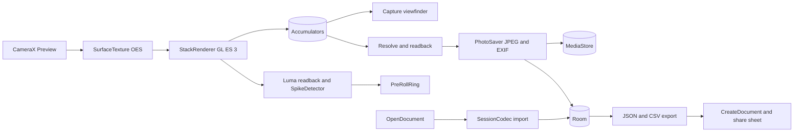

# Slowglass: the long exposure camera that builds while you watch

Put the phone on a wall above a road at night, tap once, and tail lights draw red lines across the screen while you watch. Slowglass stacks the live camera stream on the GPU into light trails, silky water, motion blur, star trails and lightning strikes, for as long as you like. It is for people whose stock camera lacks a long exposure mode and who have tried the free stackers, all rated under 4 stars. One price, no ads, no internet, and a camera check that says what your phone can do.

## 1. Overview

- **Elevator pitch:** a one-time-purchase long exposure camera whose five modes build on screen in real time, from 1 second to unlimited, saving the stack plus the sharpest frame.
- **Category:** Photography. **Launcher name:** Slowglass. **Play title:** Slowglass Long Exposure Camera.
- **Tagline:** The long exposure camera that builds while you watch.
- **Play positioning line:** The long exposure camera that works on your phone, for people whose stock camera has no light trail mode, with no ads, unlike the 2-star free stackers.
- **Price:** USD 2.99, INR 149.

## 2. Problem and why now

A Samsung, Oppo, Realme or Motorola mid-range owner sees a light-trail photo, opens the stock camera and finds no mode for it. So they search Play for "long exposure camera" or "light trails camera".

**The strongest free rival is not an app.** Xiaomi (neon trails, silky water, star trails), Huawei (Light Painting), Vivo (slow shutter) and Pixel (Motion mode) ship stacked long exposure free in the stock camera, and those brands hold much of India. Slowglass sells to owners of other phones, and the listing's first line says so. None of those stock cameras has a lightning trigger, so Lightning sells to their owners too.

**The free apps they tried.** Light Trails by MobilePhoton, the best free Play rival: 50K+, 2.8, ads and IAP (https://play.google.com/store/apps/details?id=com.mobilephoton.lighttrails). Compose: Long Exposure & Astro: 50K+, 1.6 (https://play.google.com/store/apps/details?id=com.mobilephoton.motionstacks). Star Trails by slash: 100K+, 3.9, ads, no update since September 2023 (https://play.google.com/store/apps/details?id=com.slash.startrails). Open Camera (100M+, 4.0) has manual shutter where hardware allows but no stacking (https://play.google.com/store/apps/details?id=net.sourceforge.opencamera).

**Why they pay upfront anyway.** Long Exposure Motion ProCam, the only real paid stacker, sells at USD 2.99 (Rs 340 in India) with 10K+ installs despite 2.6 stars from 250 reviews, and ranks first for "light trails camera" in India (https://play.google.com/store/apps/details?id=com.mobilephoton.motioncamera). Slow Shutter Cam holds USD 2.99 and 4.6 stars from 2.8K ratings on iOS (https://apps.apple.com/us/app/slow-shutter-cam/id357404131), and NightCap's developer says an Android version "wouldn't be practical" because of device variety (https://www.nightcapcamera.com/quick-tips-and-faq/). Device variety is why every rival rates low. So the buyer pays for what the free apps lack: a stack that works on their phone, a camera check before they rely on it, no ads, and no network.

**The honest part.** Demand is thin: ranking first everywhere is worth roughly 10K lifetime units going by Motion ProCam, new paid entrants stall (Star Trail Camera Pro, 5+), and the refuter expects hundreds to low thousands of copies a year. Demand is inferred from paid installs and review counts (https://play.google.com/store/search?q=long%20exposure%20camera&c=apps&price=2); no keyword-volume tool was reachable.

**Why now.** Motion ProCam now carries in-app purchases, TRAIL and Trailium are freemium or ad-funded, and no one-price stacker has a rating from a real review base.

## 3. Target audience and personas

- **Karthik Menon, 27, QA engineer, Bengaluru.** Realme phone, shoots Outer Ring Road traffic from a footbridge. Types **"light trails camera"**. Pays when screenshot one shows trails building live, with no ads, at under half Motion ProCam's Rs 340.
- **Dana Whitfield, 44, nurse and hiker, Asheville, North Carolina.** Galaxy A-series and a tripod, wants misty waterfalls. Types **"long exposure camera"**. Pays after reading Motion ProCam's broken-capture reviews, then seeing the tested-phones line and camera check.
- **Priyanka Deshmukh, 31, architect, Pune.** Monsoon storms over the Sahyadris; burst mode has missed every strike. Types **"lightning camera"**. Pays when screenshot four shows a strike caught from the frames before the flash.

## 4. Core concept deep-dive

**How it works.** CameraX Preview renders into a `SurfaceTexture` on Slowglass's own EGL context, so frames stay on the GPU as OES textures. AE and AWB lock at start. Frames are linearised (power 2.2) and blended into RGBA16F framebuffers when `EXT_color_buffer_half_float` exists, else RGBA8 with dithering in gamma space.

- **Light trails:** `GL_MAX` blending. "Noise smoothing" (Off, Low, High) first averages 1, 3 or 8 frames per sub-exposure so noise does not ratchet the sky up.
- **Silky water:** a true mean as a three-level tree (blocks of 64, superblocks of 64, accumulator) so no half-float blend weight falls below 1/64.
- **Motion blur:** mean tree plus a max buffer, resolved `mix(mean, max, keep * smoothstep(0.6, 1.0, luma(max)))`; "Keep lights" (default 0.5) keeps lamps sharp while crowds dissolve.
- **Star trails:** sub-exposures of 4 to 30 averaged frames ("Star sensitivity"), lightened, at the lowest AE fps range; infinity focus where manual focus is supported, else tap a star. **Gap bridging:** stars move 15.04 arcseconds per second, so after a stream gap the next sub-exposure is max-filtered with radius `ceil(gapSeconds x 15.04 / 3600 x pixelsPerDegree)` px, capped at 3 (pixelsPerDegree from Camera2 optics, 75 degree fallback).
- **Lightning:** `SpikeDetector` compares 8x4 cell luminance from a 64x36 readback with a 30-frame rolling median and fires past Low 0.12, Medium 0.07 or High 0.04, then waits 0.5 s. A GPU ring of 6 frames (3 on low-RAM phones) is the pre-roll; each strike saves the pre-roll plus 12 frames lightened, and stop saves a storm photo. Capped at 1920x1080, 30 fps, EV -1.

**Timing.** Presets 1, 2, 4, 8, 15, 30 s, 1, 2, 5, 10, 30 min and Unlimited; tap to stop; tripod delay Off, 2, 5 or 10 s. Sessions run in a camera foreground service with a notification (time, frames, Stop) and dim the window to minimum after 10 s idle. Lightning pauses its trigger whenever the screen is off. With no viewfinder surface, the service stacks into a pbuffer. Sessions save and stop at 3 percent battery or thermal CRITICAL.

**Honest output.** Resolve, `glReadPixels`, rotate to how the phone was held, JPEG 95 via MediaStore to Pictures/Slowglass. A variance-of-Laplacian score keeps the sharpest frame, saved as `_sharpest.jpg`. Output is the Preview stream size, up to 3840x2160 only where the camera check shows the GPU holds the stream rate, else 1920x1080. Nothing says "full resolution".

**The one memorable thing: the trail ring.** Around the shutter a thin Ultraviolet ring draws itself like a light trail, one lap per minute, elapsed time above it in wide Michroma numerals. Exposure clock, stop button and brand in one element, visible in every capture screenshot.

**What it refuses to do.** Everything in section 5's cut list, plus RAW, video, editing, network, account, ads and in-app purchase.

## 5. Complete feature set

**v1.0:**
1. Live-building preview in every mode.
2. Light trails with Noise smoothing.
3. Silky water.
4. Motion blur with Keep lights.
5. Star trails with gap bridging.
6. Lightning trigger with pre-roll, strike photos and a storm photo.
7. Bulb timing, tap or volume key to stop, tripod delay.
8. Long sessions in a camera foreground service that survive dimming, with battery and heat stops.
9. Honest save: stack plus sharpest frame, EXIF ExposureTime as session length, UserComment like "Slowglass Light trails, 42 s, 1,260 frames stacked at 1920 x 1080".
10. AE and AWB lock, Brightness -2 to +2 EV, tap to focus, zoom chips where supported.
11. Camera check: a 5 s first-launch self-test of stream size, fps, precision path, infinity focus and 4K; shareable as text.
12. `assets/device_quirks.json` overrides (force RGBA8, cap 1080p, skip fps request) from the device matrix.
13. Library: open, share or delete the stack or sharpest frame.
14. JSON and CSV export through `CreateDocument` and the share sheet; JSON import merges.

**Cut, per the refuter:** sound and motion-region triggers, RECORD_AUDIO, screen-off triggers, manual ISO, white balance and focus peaking, hand-held gyroscope alignment, time-lapse MP4 and exposure ramping, full-resolution claims, tablet and foldable hinge layout. Nothing was cut for offline honesty; no feature needs a network.

**v1.x:** hand-held alignment from the rotation vector sensor; checkpoint crash recovery for long sessions (moved from 1.0 for schedule); a Quick Settings tile; trail fade; Hindi and Spanish. **v2:** stacking a gallery video; two-pane Library.

## 6. Screen-by-screen UX

**Navigation.** One activity, type-safe Navigation Compose. Capture is the start destination, no bottom bar; Library opens from the last-photo thumbnail, Settings from the gear. Capture is always dark; other screens follow the system.

- **Capture:** full-bleed viewfinder. Top: zoom chips, Brightness, gear. Bottom, on a Pane scrim: mode strip (Trails, Water, Motion, Stars, Lightning), duration chip, shutter with trail ring, thumbnail. A tune icon opens mode settings and tripod delay. In a session the shutter becomes Stop.
- **Saved sheet:** stack with a Stack / Sharpest toggle, "Saved to Pictures/Slowglass", Share, Delete, Done.
- **Library:** two-column grid, newest first, mode filter chips.
- **Session:** image, Stack / Sharpest toggle, details (length, frames, gaps, stream size, strikes), Share, Delete.
- **Camera check:** a row per test, then the verdict and "Share report".
- **Settings:** defaults, dimming, volume shutter, theme, Export sessions, Import sessions, Camera check, privacy policy, licences, opt-in counts.
- **Rationale lines:** before CAMERA, and before POST_NOTIFICATIONS the first time a session runs over 30 s.

**Flow 1, trails.** Allow camera; the check reads "Your phone streams 1920 x 1080 at 30 frames a second. Stacks save at 1920 x 1080."; pick Trails and 30 s; tap the shutter; delay counts 2, 1; trails build; at 30 s "Saved to Pictures/Slowglass"; Share.

**Flow 2, stars.** Stars, Unlimited; tap a bright star to focus; start; allow notifications; screen dims; notification reads "Star trails 38:12"; Stop from the notification; Session says "1 gap bridged at 22:40".

**Flow 3, storm.** Lightning at Medium; Arm; "Strike 1 saved" per strike; Stop saves the storm photo; Library, Strike 2, Share.

## 7. Design system

**Design read:** Reading this as: a night-photography camera for phone owners without a stock long exposure mode, with an observatory-at-dusk language (dark viewfinder, wide engraved numerals like a lens barrel, one violet light), leaning toward Michroma plus Hanken Grotesk on a **blue-hour graphite and ultraviolet** palette.

**Dials.** Variance 3: a camera puts the shutter in the same place every time. Motion 3: motion reports exposure progress and answers taps, nothing else. Density 4: the viewfinder is the content; controls stay few and large for cold hands.

**Palette family: blue-hour graphite and ultraviolet.** Graphite is the sky after sunset; Ultraviolet, the one accent, is the colour a long exposure gives the blue hour, and the assigned icon hue. It stays flat (no gradient or glow in the UI) and appears only on the ring, primary buttons, selected chips and focus marks.

| Token | Light | Dark (Capture always) | Role |
|---|---|---|---|
| Dusk | #EEEDF3 | #15141C | background |
| Pane | #F8F7FB | #1F1D28 | sheets, scrim; onPrimary in light |
| Ink | #1B1A24 | #E7E5EF | text, clock |
| Haze | #585566 | #A3A0B4 | secondary text, icons, dividers at 24 percent |
| Ultraviolet | #5B3FC4 | #AE9FE8 | primary; Dusk is onPrimary in dark |
| Flare | #B0343A | #F0948F | errors, heat and battery notes |

Ultraviolet HSL saturation 53 percent light, 61 dark. Contrast by script (light, dark): Ink on Dusk 14.8, 14.7; Haze on Dusk 6.2, 7.2; Ultraviolet on Dusk 6.1, 7.8; Pane on Ultraviolet 6.7; Dusk on Ultraviolet 7.8; Flare on Pane 5.8, 7.4. No pure black or white. Text over the live image sits on the Pane scrim.

**Type.** **Michroma** 400 (Vernon Adams, SIL OFL 1.1), only where a camera would engrave: the clock (40sp, each digit in a fixed-width slot), duration chip (16sp), mode names (13sp). **Hanken Grotesk** (Hanken Design Co., SIL OFL 1.1) for the rest: 400 body 16sp, 500 labels 14sp, 600 titles 22sp and buttons 15sp. No serif. Licences go in `docs/OFL-Michroma.txt` and `docs/OFL-HankenGrotesk.txt`.

**Radius and icons.** 6dp chips, 12dp buttons and thumbnails, 20dp sheet tops; shutter and zoom chips are full circles, the documented camera-hardware exception. Lists use spacing and dividers, not cards. Material Symbols Rounded via `material-icons-extended`; shutter and ring drawn in Canvas.

**Motion.** No first-run moment. The ring advances per frame (per second under reduced motion); Shutter morphs to Stop in 200 ms; the saved sheet rises in 250 ms; all snap under `LocalReducedMotion`.

**States.** Loading is always a skeleton in the content's shape past 300 ms, never a spinner (Capture shows the Dusk frame with controls placed).
- *Capture:* denied "Slowglass needs the camera to make long exposures." with "Allow camera"; error "Another app is using the camera. Close it and tap to retry."; success is the live preview.
- *Saved sheet:* error "Could not save the photo. Free some space, then tap Save." with a Save button, the stack held in memory until then; success "Saved to Pictures/Slowglass."
- *Library and Session:* empty "Your long exposures will appear here." with "Open camera"; a missing file reads "Photo not on this phone" with "Delete entry".
- *Camera check:* failure like "Your phone did not accept a low frame rate. Star trails will use the default rate."; success is the verdict.
- *Settings:* error "That file is not a Slowglass session log."; success "Exported 23 sessions" or "Imported 23 sessions".
Capture, the saved sheet, Camera check and Settings have no empty state by design.

**Access.** WCAG AA as measured; 48dp targets, 76dp shutter; content descriptions on icon buttons; text scales to 200 percent.

**Tablet and foldable.** Hinge layout cut. Portrait as a viewfinder; at 600dp and wider, where Android 16 ignores the lock, the controls column moves to the right edge. Check 841x701 and 1280x800 dp.

**Icon brief.** Violet ground, a two-stop gradient #8F4DEA to #7032D6 (hue 262 to 266, saturation 67 to 79, lightness 52 to 61) with a faint glass sheen across the top left corner, a hue no registry row uses and the UI accent's family. Mark: three night-road light trails converging on one vanishing point at the lower left and fanning up round a bend, hairline tails and thick rounded heads, near-white #F7F4FF shading to lilac #E3D8FD at the tails (3.5:1 at the palest point), one soft shadow in the ground hue; mono layer the same three trails. The notification icon uses the same silhouette.

**Screenshots (9:16, dark, real sessions only).** (1) Trails mid-session, ring at 0:24, strap "No ads. No account. No internet. Checked on Samsung, Xiaomi, Oppo, Vivo, Realme and Pixel phones." (brands that passed only); (2) silky water; (3) star trails, "1 gap bridged" (a Motion blur street if no real star session exists by week 6); (4) "Strike 2 saved"; (5) duration sheet on Unlimited; (6) camera check beside Library.

## 8. Native architecture

**Generator flags line:**
`bash _shiptools/native/new-native-app.sh --dir DEVPROJECTS/slowglass --name "Slowglass" --pkg com.mohdshayan.slowglass --perms "CAMERA,FOREGROUND_SERVICE,FOREGROUND_SERVICE_CAMERA,POST_NOTIFICATIONS,WAKE_LOCK" --room --camerax --orient portrait --bg "#15141C" --bg-dark "#15141C"`

Both are Dusk so the first frame matches the viewfinder; then set `LightBackground` to #EEEDF3. Raise `minSdk` to 29 (no storage permission for MediaStore writes, thermal API, and no Android 8 and 9 camera HALs the matrix cannot cover). Remove `androidx-camera-view`; the app draws its own viewfinder.

**Modules.** `:app` and `:core` (pure Kotlin JVM with `kotlin-jvm` and `kotlin-serialization`; add `kotlin-jvm = { id = "org.jetbrains.kotlin.jvm", version.ref = "kotlin" }`).

**Package map.** `:core`: `stack`, `stars`, `lightning`, `sharp`, `timer`, `exif`, `orient`, `check`, `quirks`, `export`. `:app`: `capture` (CaptureService, a `LifecycleService` of FGS type camera; CameraController; a debug-only VideoFrameSource), `gl` (EglCore, StackRenderer, PreRollRing), `save`, `data`, one `ui/` package per screen. ViewModels (Capture bound to the service, Library, Session, CameraCheck, Settings) use `stateIn(WhileSubscribed(5_000))`; the service owns the EGL context and draws into the activity's `SurfaceView`.

**Catalog aliases.** `androidx-core-ktx`, `androidx-core-splashscreen`, `androidx-lifecycle-runtime-ktx`, `androidx-lifecycle-runtime-compose`, `androidx-lifecycle-viewmodel-compose`, `androidx-activity-compose`, `androidx-compose-bom`, `androidx-ui`, `androidx-ui-graphics`, `androidx-ui-tooling`, `androidx-ui-tooling-preview`, `androidx-material3`, `androidx-material-icons-extended`, `androidx-navigation-compose`, `androidx-room-runtime`, `androidx-room-ktx`, `androidx-room-compiler`, `androidx-datastore-preferences`, `androidx-camera-core`, `androidx-camera-camera2`, `androidx-camera-lifecycle`, `kotlinx-coroutines-android`, `kotlinx-coroutines-test`, `kotlinx-serialization-json`, `junit`; plugins `android-application`, `kotlin-android`, `kotlin-compose`, `kotlin-serialization`, `ksp`, `kotlin-jvm`. Added: `androidx-lifecycle-service` (lifecycle-service, version.ref lifecycle), `androidx-exifinterface` (1.3.7), `play-review-ktx` (com.google.android.play:review-ktx 2.0.2; drop it and the prompt if it adds a permission).

**Hardware and assets.** CameraX with Camera2Interop; OpenGL ES 3.0 and `android.hardware.camera.any` as required features; `OrientationEventListener` and the thermal listener need no permission. Bundled: `device_quirks.json` (under 10 KB, own work), `privacy.html`, four OFL TTFs under 400 KB, no models. Debug clips in `app/src/debug/assets/clips/` never ship.

**Manifest permissions.**
- `CAMERA`: the app is a camera; frames are stacked on the device and never leave it.
- `FOREGROUND_SERVICE`: long exposures continue through dimming, app switches and rotation.
- `FOREGROUND_SERVICE_CAMERA`: the type of that service, started only by a shutter tap in the visible app.
- `POST_NOTIFICATIONS`: the session notification with time and Stop; optional.
- `WAKE_LOCK`: a partial wake lock held only during a session so a star session survives the screen turning off.

No INTERNET, storage, media, RECORD_AUDIO or location permission.

**Background work.** The camera foreground service only; no WorkManager, alarms, widgets or tiles in 1.0.



## 9. Data model

**Room entities.**
- `Session`: `id: Long` PK, `startedAt: Long`, `endedAt: Long`, `mode: String`, `durationMs: Long`, `frameCount: Int`, `droppedFrames: Int`, `gapsBridged: Int`, `gapLog: String` (JSON ms offsets), `streamWidth: Int`, `streamHeight: Int`, `precision: String`, `rotationDegrees: Int`, `settingsJson: String` (EV, zoom, mode settings), `stackUri: String?`, `sharpestUri: String?`, `note: String`.
- `Strike`: `id: Long` PK, `sessionId: Long` FK cascade indexed, `at: Long`, `peakDelta: Float`, `photoUri: String`.
- `CameraCheck`: `id: Long` PK, `ranAt: Long`, `cameraId: String`, `streamWidth: Int`, `streamHeight: Int`, `measuredFps: Float`, `halfFloat: Boolean`, `infinityFocus: Boolean`, `holds4k: Boolean`, `verdict: String`.

**DataStore keys.** `default_mode`, `bulb_preset_ms` (0 is Unlimited), `tripod_delay_s`, `noise_smoothing`, `keep_lights`, `star_sensitivity`, `lightning_sensitivity`, `dim_during_session`, `volume_keys_shutter`, `save_sharpest`, `theme_mode`, `camera_check_done`, `success_count`, `review_prompted`, `usage_counts_opt_in`, `count_sessions`, `count_saves`, `count_strikes`.

**Export and import.** `slowglass-sessions-YYYY-MM-DD.json` with `format`, `schema`, `prefs`, `sessions` (with nested `strikes`) and `cameraChecks`; import validates, merges on `(startedAt, mode)` in one transaction and flags missing photos. CSV: `started,mode,length_s,frames,dropped,gaps_bridged,width,height,precision,strikes,stack_file`. The photos are already ordinary files in Pictures/Slowglass.

## 10. Pricing and countries

USD 2.99 and INR 149: the ladder's consumer log or calculator rung (USD 2.99 / Rs 149), one step below the creative or media tool rung the idea sat near, because demand is thin and the only paid rival sits at USD 2.99. The refuter floated Rs 99; the wave-two decision set Rs 149, inside the INR 99 to 300 band where Indian utilities sell and under half Motion ProCam's Rs 340. Other emerging markets hand-set at 25 to 50 percent of USD; a 20 percent sale in week two. Refunds follow Play's 48-hour window, and the first-minute camera check exists so nobody pays and then discovers a 720p stream. All countries, English UI.

Why this niche pays this much: buyers already pay USD 2.99 for a 2.6-star Motion ProCam and for Slow Shutter Cam on iOS; more would need a review base this niche has never given anyone.

## 11. Play Store listing

**Title (30 of 30):** `Slowglass Long Exposure Camera`

**Short description (78 of 80):** `Light trails, silky water, star trails, lightning. One price, no ads, offline.`

**Full description (1,547 of 4,000):**

```
Light trails, silky water and star trails, built live from the camera stream, on phones whose stock camera has no long exposure mode.
Rest the phone on a tripod or a wall, tap once, and watch the exposure grow for a second, an hour, or until you tap stop.
One price. No ads, no account, and no internet permission at all.

Five ways to slow the glass
Light trails: headlights draw lines across the frame.
Silky water: waterfalls turn to mist.
Motion blur: crowds smear while street lights stay sharp.
Star trails: bright stars and planets drawn into arcs.
Lightning: each strike saved from the frames just before the flash.

Exposures without a time limit
Pick 1 second, 10 minutes or unlimited, and stop whenever you like. Long sessions keep running with the screen dimmed.

Honest output
Photos are saved at the size your camera streams to the app, often 1920 x 1080 and up to 3840 x 2160. This is not full sensor resolution, and Slowglass tells you the exact size on first launch. It also saves the sharpest single frame.

Checked on real phones
Before release, Slowglass was tested on Samsung, Xiaomi, Oppo, Vivo, Realme and Pixel phones, and a short camera check on first launch tells you what your phone can do.

Your sessions, your files
Export the session log as JSON or CSV through the share sheet, and import it on a new phone.

What it does not do
No manual ISO or white balance, no RAW, no video and no hand-held alignment. Use a tripod or something steady.

One-time purchase. No ads, no subscription, no account. Works fully offline.
```

Any brand that failed the matrix leaves this text and screenshot one, then recount.

**Superseded for 1.0 (orchestrator decision):** the shipped listing (`store/listing.md`) and screenshot one name no brand and no device, and make no "any phone" claim, until the phone pass is done; only verified devices may be named afterwards, every other brand is recorded as untested. Only one line says "No ads": the one-time purchase paragraph.

**Keywords:** long exposure camera, light trails camera, star trail camera, lightning camera, silky water, motion blur camera, night photography. Not "slow shutter camera" in India, where it returns manual camera apps.

**Screenshot captions:** (1) Light trails that build while you watch; (2) Silky water from any steady spot; (3) Star trails from one long session; (4) Lightning caught before the flash; (5) Stop when it looks right; (6) Know what your phone can do.

**Feature graphic.** Icon ground and mark, "Slowglass" in Michroma, "Long exposures that build while you watch".

**Category** Photography. **Content rating** Everyone. **Target age** 18 and over. Paid, no ads, no in-app purchases, works offline.

## 12. Policy and data safety

Data collected: none. Shared: none. No ads, analytics or crash SDK; on-device camera processing is not collection. The hosted HTML privacy policy is generated from the five permissions, bundled as `assets/privacy.html` and linked in Settings. **FGS declaration:** the camera-type form needs a video recorded on the S22+ (start Star trails, show the notification, go home, return, Stop). Describe it as "user-started long exposure capture that continues while the screen is dimmed or the user switches apps". No health, financial or government feature. **The listing must not claim** full resolution, DSLR quality, RAW, "works on any phone", security, wildlife-trap or surveillance use, deep-sky astrophotography, an untested brand, or any competitor's name.

## 13. Organic growth

"Slowglass" carries no keyword, so "Long Exposure Camera" follows it. The short description adds "light trails", "silky water", "star trails" and "lightning"; the description's first line repeats the first three with "long exposure". The `review-ktx` prompt fires once, when the third successful save's sheet is dismissed, never on first launch or mid-session. Launch with a 30-second recording of trails building on r/AndroidApps and r/NightPhotography within their rules. Answer every review naming a phone with a fix. Not done: paid UA, fake reviews, a free twin, competitor names, "any phone" claims.

## 14. KPIs

Opt-in local counts stay in Settings. The three numbers, from Play Console:
1. **Refunds under 10 percent**: the camera check and first session keep the screenshots' promise.
2. **Rating 4.5 or higher after 20 ratings**, against a field rated 1.6 to 3.9; this is the reason to buy.
3. **Listing conversion at or above the Photography peer median**: the first screenshot and the honest-output paragraph are doing their job.

Opt-in counts (sessions, saves, strikes) never leave the phone; a user may paste them, with a camera check report, into a support email that feeds the quirks file.

## 15. Risks and mitigations

- **Refund window.** A first trail inside 60 seconds; real-session screenshots only.
- **Stock long exposure on Xiaomi, Pixel, Vivo, Huawei (biggest free incumbent).** Listing aims at other phones; Lightning sells to all.
- **Hardest subsystem: GL stacking across the camera zoo.** Half-float support, stream sizes and fps ranges vary. The camera check picks the path, with an RGBA8 fallback, the quirks file, CPU reference math in `:core` and the device matrix as release gate.
- **Thin star trails.** The listing says "bright stars and planets" only.
- **Heat and battery.** Stack every other frame at thermal SEVERE; save and stop at CRITICAL or 3 percent battery.
- **FGS declaration rejected.** Tap-only start, visible notification, clear video; fallback keeps the activity in front with the screen on and drops the service.
- **GPU memory at 4K.** Motion blur needs roughly 330 MB there, so under 6 GB RAM the check picks 1920x1080.

## 16. Competitive landscape

- **Stock cameras (Xiaomi, Pixel, Vivo, Huawei):** free, built in. Slowglass serves every other phone, and lightning.
- **Motion ProCam (MobilePhoton):** USD 2.99 / Rs 340 plus IAP, 10K+, 2.6, 2026-08-10. No IAP, under half the India price, a camera check.
- **Light Trails (MobilePhoton):** free, ads and IAP, 50K+, 2.8, 2026-08-10. No ads, water and lightning too.
- **Compose: Long Exposure & Astro:** free, ads, 50K+, 1.6, 2026-08-14. Saves what it showed.
- **Star Trails (slash):** free, ads, 100K+, 3.9, last 2023-09-20. Maintained, no ads.
- **Star Trail Camera Pro and Lightning Camera Pro (Aurora Status):** USD 3.49, 5+, unrated, 2026-09-04; USD 1.49, 100+, 3.7, 2026-09-02. One app, five modes.
- **Catch Lightning:** free, ads, 10K+, 3.5, 2026-08-22. No ads mid-storm.
- **TRAIL (Hugo Software), Trailium (Observin):** free with IAP, 0+, unrated, 2026-09-05; free with ads, 1K+, 2026-09-09. One price, nothing locked.
- **DeepSkyCamera Pro:** USD 9.49, 1K+, 3.9, 2026-06-08. Deep sky; Slowglass is a third of the price.
- **Open Camera (free, 100M+, 4.0, 2026-05-28) and Manual Camera DSLR Pro (USD 4.99, 1M+, 4.0, last 2024-02-07):** manual controls, no stacking.

## 17. Development plan

Six weeks solo.
- **Week 1:** generate, minSdk 29, fonts, tokens; EglCore, CaptureService, Preview into SurfaceTexture, viewfinder; `:core` BlendMath, MeanTree, BulbPreset with tests.
- **Week 2:** stacking shaders, half-float fallback, readback, PhotoSaver, sharpest frame, saved sheet, debug video source.
- **Week 3:** trail ring, bulb, foreground service, dimming, wake lock, exposure controls, thermal and battery stops, Camera check and the quirks file.
- **Week 4:** Star trails and Lightning.
- **Week 5:** Room, Library, Session, Settings, export and import, all states, 600dp; first matrix run of the instrumented test.
- **Week 6:** matrix fixes through the quirks file, icon, screenshots, listing, privacy page, FGS video, preflight.

**Cut if behind, in order:** zoom chips, Keep lights slider, storm photo. Never the five modes, service, sharpest frame, camera check or matrix.

**Device matrix (release gate).** Play pre-launch report plus a Firebase Test Lab test (stack 5 s per mode, assert JPEG size equals stream size) on Samsung, Xiaomi, Oppo, Vivo, Realme and Pixel mid-rangers, borrowing phones for brands neither offers; night sessions on the S22+ under the shared phone lock with `ANDROID_SERIAL` pinned. A failing brand leaves the listing.

**JVM tests (`:core`).** MeanTree over 100,000 frames within 1e-4 of the mean. Lighten equals per-channel max. GapBridge: 10 s at 25.6 px per degree gives radius 2, 60 s caps at 3. PixelsPerDegree: 5.4 mm lens, 6.4 mm sensor, 1920 px gives about 31.3. SpikeDetector fires on a 0.08 cell rise at Medium and ignores slow brightening. SharpnessScore ranks a checkerboard above its blur. ExposureClock, OrientationMapper, QuirkRules, SessionCodec round trip.

**Emulator smoke.** A 4 s Trails save on the virtual scene appears in Library; export, clear data, import restores it; rotation mid-session continues; both themes and airplane mode unchanged.

**android-ship preflight.** Merged manifest holds exactly the five permissions plus AndroidX's self-scoped `DYNAMIC_RECEIVER_NOT_EXPORTED_PERMISSION`; `foregroundServiceType="camera"`; SocialSure-signed release; `verify.sh` clean; no debug clips; privacy URL live before Data safety; Paid set before first release; prices hand-set; FGS video uploaded; listing recounted; zero em-dash or en-dash; OFL files in `docs/`.
